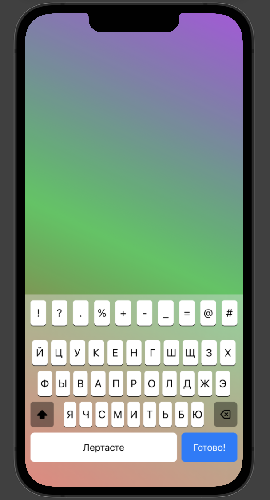
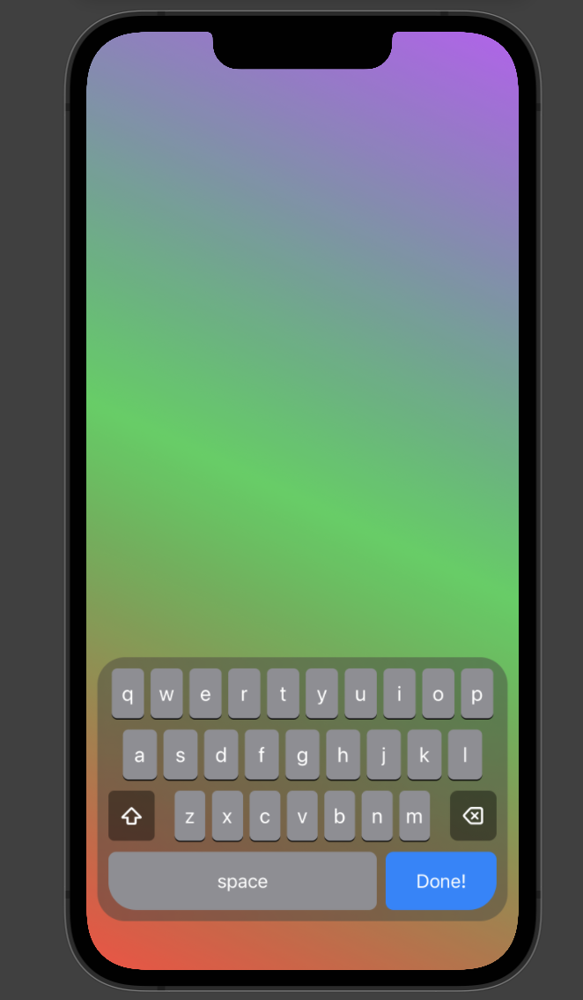

# SimpleKeyboard

[](https://github.com/thisIsTheFoxe/SimpleKeyboard/actions?query=workflow%3ASwift)
[](https://github.com/thisIsTheFoxe/SimpleKeyboard/actions?query=workflow%3ASwiftLint)
[](https://codecov.io/gh/thisIsTheFoxe/SimpleKeyboard)
[](https://sonarcloud.io/dashboard?id=thisIsTheFoxe_SimpleKeyboard)

The idea of this package came from a [keyboard extension](https://developer.apple.com/design/human-interface-guidelines/ios/extensions/custom-keyboards/) and the fact that - AFAIK - one can't open another keyboard within a keyboard extension. So the goal was to have a ViewController, that simply displays the keyboard and changes a `text` variable.

## UI Themes
As the goal of this idea was to simply imitate the system keyboard that's a lot where the inspiration came from.
However, inspired by [a Tweet from @laurentdelrey](https://twitter.com/laurentdelrey/status/1511381985003900928?s=21&t=V0I3aQ7vQzuFCf6t5WAoYA) I decided to also include a floating keyboard with some nice rounded corners.

### SimpleStandardKeyboard Screenshots
|System (in light)|Floating (in dark)|
|---|---|
|||

## Components
This  project includes a `SimpleKeyboard` that takes a custom 2D-list of Strings which will be rendered as the keys.
The `SimpleStandardKeyboard` provides a default implementation for some languages and a few more default settings.

## Usage
Depending on the needs one can use the keyboards in a larger SwiftUI environment with a `Text` that will act as the TextField. 
Or one can choose to only display the keyboard with a the text input coming from a UIKit environment. To eventually get a `UIViewController` one has to use a `UIHostingController`. To manage the transition with all the Bindings, one can use the `KeyboardSettings`. 

### Use SimpleKeyboard with UIKit
Here is an example implementation from one of my projects:
```swift
class MyViewController: UIViewController {
    @IBOutlet var textField: UITextField!
    
    //..........
    
    func presentKeyboard() {
        let keyboardSettings = KeyboardSettings(language: .english, textInput: self.textField)
        let keyboardVC = MyKeyboardMaker(settings: keyboardSettings).makeViewController()
        self.contentController.pushViewController(keyboardVC, animated: true)
    }
}

```

```swift
struct MyKeyboardMaker {
    
    @ObservedObject var settings: KeyboardSettings
    
    func makeViewController() -> UIHostingController<SimpleStandardKeyboard> {
        UIHostingController(rootView: SimpleStandardKeyboard(settings: $settings)
    }
}
```

When initializing a new object of that struct, one has to pass the language and textField. Now `makeViewController()` can be called e.g. pushed onto a NavigationController.  

